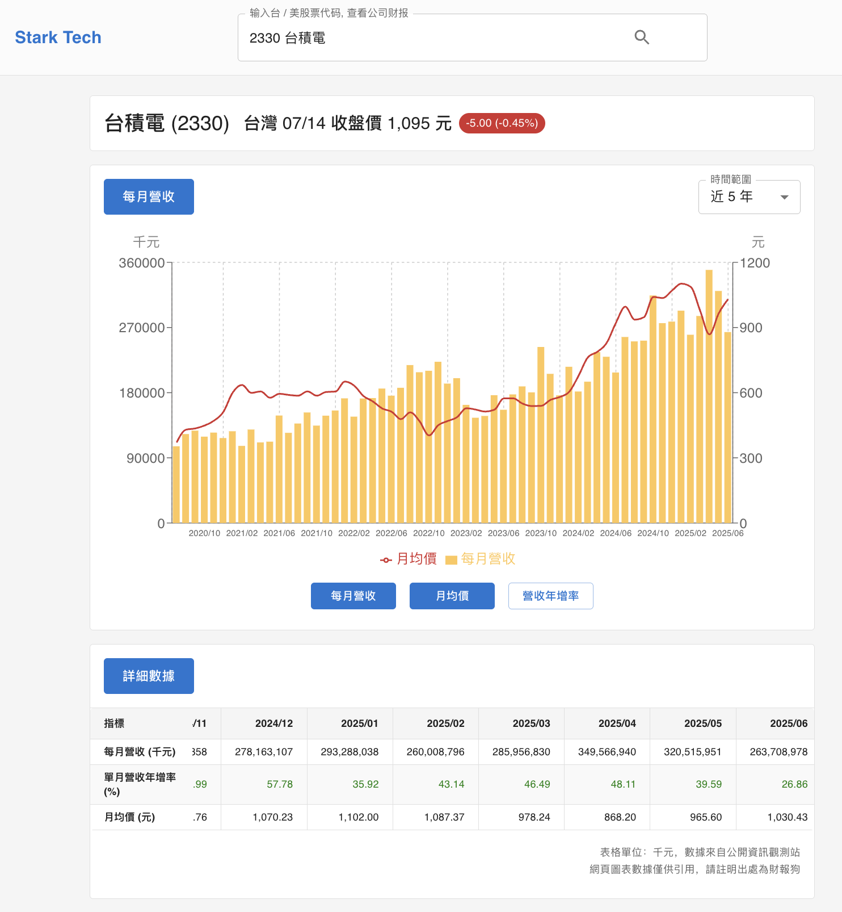
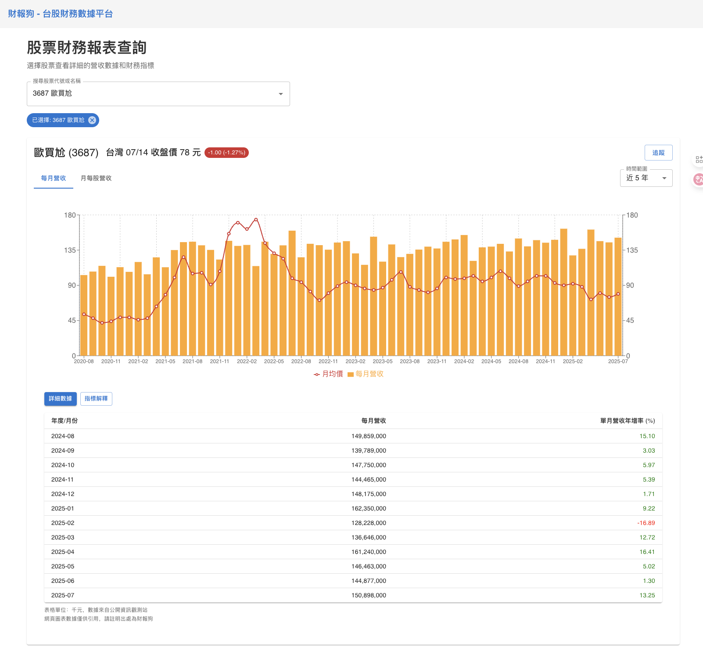
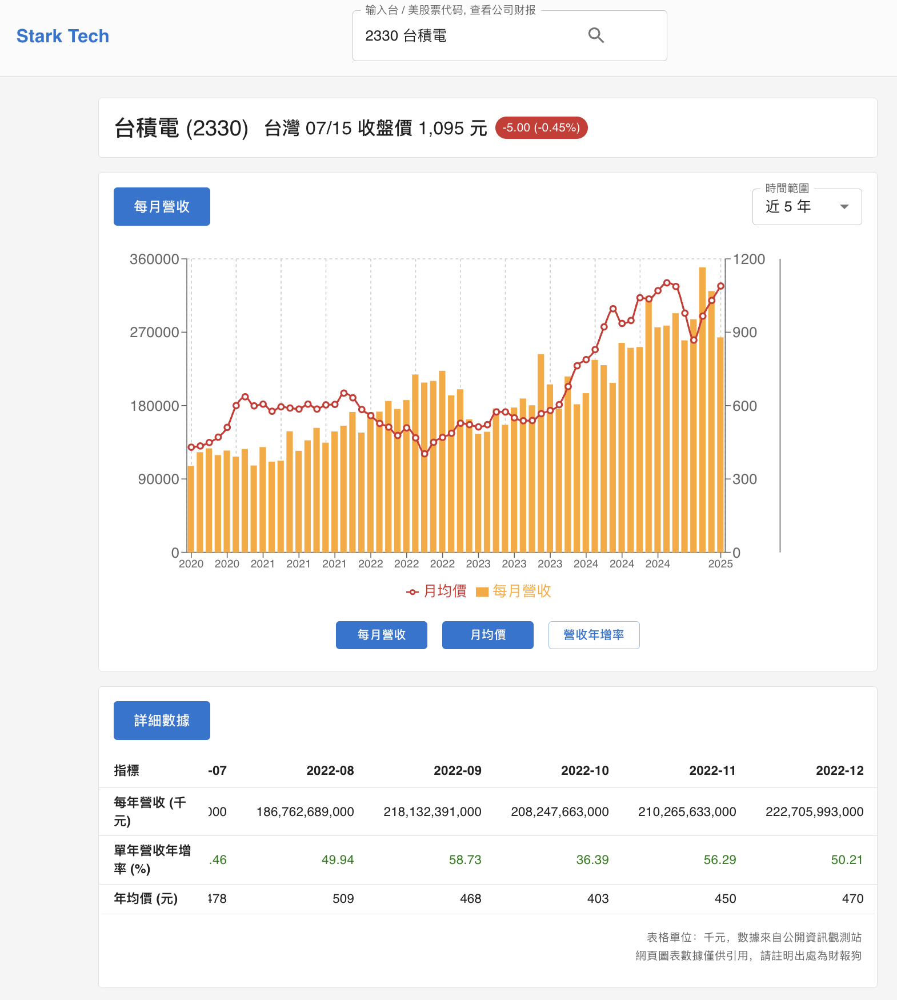

# Stark Tech 前端面试作业

候选人: 王策

## 项目说明

整个项目使用 TypeScript, Next.js, React.js, MUI 开发, 使用 recharts 作为图表组件, 使用 finmindtrade 的 API 获取数据

## 立即体验



[https://stark-tech-hw-stock.vercel.app/](https://stark-tech-hw-stock.vercel.app/)

## 启动说明

```
git clone https://github.com/HaloWang/stark_tech_hw_stock.git
cd stark_tech_hw_stock
npm install
npm run dev
```

## 工作历史记录

1. 接收产品需求
2. 理解产品需求
3. 使用 `npx create-next-app@latest` 创建项目
4. 添加 prettier
5. 最近使用过 [gemini-cli](https://github.com/google-gemini/gemini-cli), 感觉很不错, 准备在这个项目中大规模使用
6. 添加 GEMINI.md 文件, 期望使用 vibe coding 大幅增加开发效率
7. 首次提交至 github repo
8. 了解到 [MUI](https://mui.com/) 存在 Chart 组件
9. 优先选组 Zustand 作为状态管理
   1. 了解到 [openai 的前端项目](https://github.com/openai/openai-fm)在使用 Zustand
   2. 感知到 Zustand 可能为当前前端业界跨组建状态管理的首选方案
10. 我和 gemini 说 "给我添加 MUI 依赖", 但是, 我发现 gemini 直接根据 `GEMINI.md` 把项目的逻辑写好了, 我得到了 snapshot.0.png 文件


11. 我发现 gemini-cli 不允许上传图片: `[API Error: {"error":{"message":"{\n  \"error\": {\n    \"code\": 400,\n    \"message\": \"Unable to process input image. Please retry or report in
https://developers.generativeai.google/guide/troubleshooting\",\n    \"status\": \"INVALID_ARGUMENT\"\n  }\n}\n","code":400,"status":"Bad Request"}}]`
12. 发现 finmindtrade 的 API 报 `402` 了, 申请了 API key, 并添加到 `.env.local` 文件中
13. 我和 Cursor IDE 说: "按照 @statementdog.png 文件中的需求完成整个项目", 我得到了 snapshot.1.png 文件



14. 和 Cursor 大量沟通后, 我得到了 snapshot.2.png 文件



15. 我认为我必须要人工 coding 一下代码了, cursor 已经开始丢失上下文了
    1.  BUG: 数据和 statementdog 不一致, 出现了错位和丢失
    2.  PRD: 文本需求和图片需求冲突 (单月营收年增率 or 月均價)
        1.  如果都渲染, 那么交互还需要调整
    3.  UI 调整一下
    4.  代码风格
16. 基本完成

## 技术栈

- TypeScript
- Next.js
- React.js
- [MUI](https://mui.com/)
- 使用腾讯云部署 dist/ 目录

## 涉及技术问题

[Questions.md](./Questions.md)

## TODO

- [ ] 了解到合作伙伴期望看到结构较好的组件分层, 让我来做一下
- [x] 最后请一定核对一下 PRD 和 statementdog, 确保没有数据上的 Bug
- [x] 在提交前在阅读一遍 notion 上的 PRD, 看看还有没有什么疏漏
- [ ] 部署至腾讯云
- [ ] 使用 SSG 优化整个项目, 针对访问频繁的股票, 如台积电, 鸿海, 联发科, 等等, 使用 SSG 优化
